# CI/CD, Automated Testing, And Jira Flow

This document maps the automated testing flow to the Language Tutor project.

## Project Flow

```mermaid
flowchart LR
    dev["Developer<br/>git push / pull request"] --> repo["GitHub Repository"]
    repo --> trigger["GitHub Actions Trigger"]
    trigger --> checkout["Checkout code"]
    checkout --> setup["Setup .NET 8, Node 22, Docker"]
    setup --> build["Build backend and frontend"]
    build --> compose["Start Docker Compose test stack"]
    compose --> tests["Run xUnit + Selenium WebDriver tests<br/>TC1-TC18"]
    tests --> results["Store TRX, Docker logs, screenshots, Allure results"]
    results --> decision{"All tests pass?"}
    decision -->|Yes| success["CI success<br/>deployment workflow may continue"]
    decision -->|No| jira["Create or update Jira Bug<br/>from failed TC"]
    jira --> failure["CI failed<br/>developer fixes bug"]
```



## How This Is Implemented

| Flow step | Project implementation |
| --- | --- |
| Source code trigger | `.github/workflows/ci.yml` on push, pull request, or manual run |
| Backend build | `dotnet restore` and `dotnet build` in `backend-aspnet` |
| Frontend build | `npm ci` and `npm run build` in `frontend-react` |
| Test environment | `docker-compose.selenium.yml` starts PostgreSQL, ASP.NET backend, React/nginx frontend, Selenium Chromium, and the xUnit test container |
| Automated test runner | `tests/LanguageTutor.E2E` with xUnit, Selenium WebDriver, and Allure attributes |
| Test report | `TestResults/selenium.trx`, `TestResults/allure-results`, and generated `TestResults/allure-report` |
| Logs and artifacts | GitHub Actions uploads the whole `TestResults` directory as `selenium-results` |
| Jira testcase links | Each test uses `AllureIssue("LT-x")` and `tests/LanguageTutor.E2E/TestCases/jira-testcases.json` |
| Jira bug sync | `scripts/jira-sync-failed-tests.ps1` creates or updates Bug issues only when tests fail |

## Automated Test Coverage

| Test range | Coverage |
| --- | --- |
| `TC1`-`TC4` | API and frontend smoke checks |
| `TC5`-`TC6` | Student route protection, registration, course browsing, logout, login |
| `TC7`-`TC11` | Sign-up validation test cases from the report |
| `TC12`-`TC14` | Login and role-routing test cases from the report |
| `TC15`-`TC16` | Admin add-user test cases from the report |
| `TC17`-`TC18` | AI exercise creator form test cases from the report |

## Local Commands

Run the same automated test stack locally:

```powershell
docker compose -f docker-compose.selenium.yml up --build --abort-on-container-exit --exit-code-from tests
```

Generate the Allure report:

```powershell
npx --yes allure-commandline generate TestResults\allure-results --clean --output TestResults\allure-report
```

Open the report:

```powershell
python -m http.server 8089 --directory TestResults\allure-report
```

Run Selenium with a visible browser UI:

```powershell
.\scripts\run-selenium-ui.ps1
```

Create Jira testcase tasks:

```powershell
.\scripts\jira-create-testcases.ps1
```

Sync failed test results to Jira bugs:

```powershell
.\scripts\jira-sync-failed-tests.ps1 -ResultsDirectory TestResults
```

## Required GitHub Secrets

Configure these in GitHub repository settings under `Settings > Secrets and variables > Actions`:

| Secret | Purpose |
| --- | --- |
| `JIRA_BASE_URL` | Base Jira Cloud URL, for example `https://your-domain.atlassian.net` |
| `JIRA_PROJECT_KEY` | Jira project key, for example `LT` |
| `JIRA_EMAIL` | Atlassian account email |
| `JIRA_API_TOKEN` | Atlassian API token |

If these secrets are not configured, the CI still runs tests and uploads reports. Jira bug sync is skipped.
